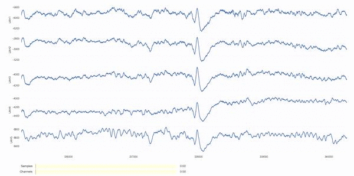

# multiplot
Interactively plot multiple time series.

Developed for plotting and marking of high-dimensional ECoG (electrocorticography) data.

For usage examples, consult the [tutorial notebook](tutorial.ipynb).

